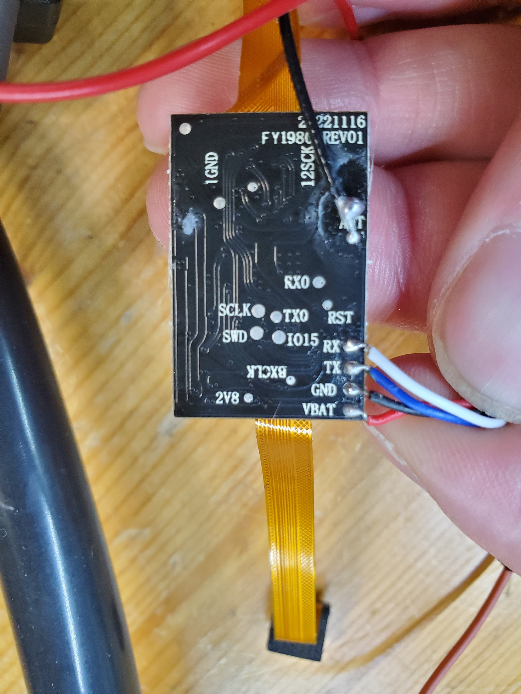
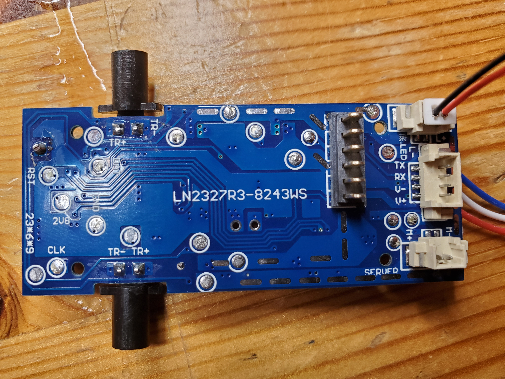

# z908pro

## Overview

The drone has a camera board and a driver board. We think that the driver board is responsible for most of the drone's functionality, while the camera board is responsible for the camera and WIFI functionality.

The camera board also controls a second downward-facing camera, which is probably used to detect the height. If that downward camera did not exist, there would probably be no reason for the two boards to communicate.

However, we think it could also be possible that the driver board is dumb and just sends the drone's state to the camera board and receives instruction from the camera board. We have not yet tried to disconnect the camera board and see if the drone still works.

## Battery

The Battery is a 2000 mah 3,7 Volt LiPo.
The Chip on the Battery Controller says "LC 9" and has some resistors and Capacitors around it. It is connected to the USB Port.

## About the Drone

Aliexpress Link: https://de.aliexpress.com/w/wholesale-z908pro.html

## Boards

### Camera board




The drone contains two boards, one containing a bouffalo lab IC (risc v?) and something that could be an SPI flash.

The two flat connectors lead to the front and bottom camera.

The four wires connect UART (pins `TX` and `RX`)to the driver board. The controller board sent some data on that port, but we could not read any useful data on that connection; it was just binary garbage. Either we did not try the correct baud rate, the protocol is something binary, or the data is encrypted.

On the bottom, there is also a second serial port, `RX0`, `TX0`. When the drone starts, a [log](#bootloader log) is printed on that port. The boot log contains a reference to the BLSP_Boot2, which is a bootloader for Bouffalo Lab Chips. We grepped the binary for some strings from the boot log and found some matches, so we are quite sure that the chip is a Bouffalo Lab Chip. Not sure which one, though. After the bootloader log, it switches to random binary garbage, which is probably the output of the actual firmware. Maybe it just changes the baud rate or something like that.

There are pads for `SCLK` and `SWD`, but we have not yet attached a debugger to the board.

There also is a SOIC-8 IC next to the microcontroller, which is probably a flash chip. We have not yet tried to read the contents of that chip.

### Driver board

The driver board seems to contain everything besides the camera.




#### Connectors

The backside has 2 two pin connectors, one labeled `LED`, which connects to the bottom LED, and one labeled `SERVO`, which connects to the camera tilt servo.

The backside also contains a 4-pin connector, which connects RX and TX to the camera board.

The front contains two 2-pin connectors, one labeled `LED`, which connects to both front LEDs, and one unlabelled one, which connects to the front IR LED. The front also contains a soldered three-wire connection to the bottom IR LED.

It has four 4-pin connectors labeled `M1`, `M2`, `M3`, and `M4` for the four brushless motors.

There is also an antenna and a left and right IR LED that goes directly to the board.

#### Chips

The board has a small Mixic MX116H motor controller, which connects to the camera servo.

There is a bigger unlabelled 24-pin IC, which is probably a microcontroller responsible for the drone control. It is connected to most things on the board, including the motors, the camera servo, the LEDs, and the camera board.

There are seven transistors-looking 3-pin ICs, which are probably used to drive the four motors and to drive or amplify the IR LEDs.

The board also contains a small 14-pin QFN IC, which could be a gyro or accelerometer. Its labeled:

```
14267
U03AF1
2211
```

but we were not able to find any information about it.

There also is an IC with a metal case and a hole in it. It is probably a barometric pressure sensor because it looks like one, and that makes sense for a drone.

## Bootloader Log

```
system clock=000000A0BLSP_Boot2_CP:Dec 22 2021,19:38:18
commit id=9f75399d1831379c92c2b0d58faee73a3af03277
xActive PT:0,0ig
MFG not foundGet FW ID:0
Name=FW_CPU0
Age=0
active Index=0
active Address=00060000
Check Img
Get FW ID:1
Entry not found
Boot start
Media boot main
R header from 00060000
sign 0,encrypt:1
R IV
Cal hash
Success
0,0
Success
CPU 1 not boot
Found One img Only
49b7da91,19879f81
49b7da91,19879f81
00061000,00000000
00061000,0000000f
CPU Count 2,0
Counter value=15810757
     +++++ RANDOM BINARY GARBAGE +++++
```
